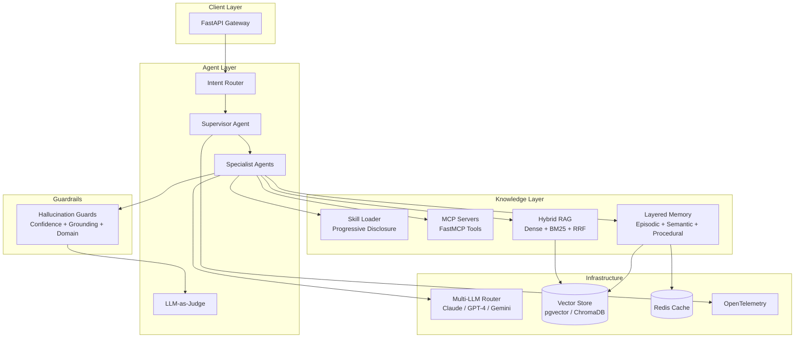

<div align="center">

# AgentOS

**The open-source framework for building production-grade, vertically-specialized AI agent systems.**

[](https://www.python.org/downloads/)
[](LICENSE)
[](https://ai.pydantic.dev/)
[](https://github.com/jlowin/fastmcp)

</div>

---

## Architecture



---

## Features

- **Multi-Agent Orchestration** — Supervisor-specialist pattern with intent routing and automatic delegation.
- **Hybrid RAG Pipeline** — Dense embeddings + BM25 sparse retrieval fused via Reciprocal Rank Fusion (RRF).
- **MCP Tool Servers** — Expose domain capabilities as Model Context Protocol tools using FastMCP.
- **Layered Memory** — Episodic, semantic, and procedural memory with configurable TTL and relevance decay.
- **Progressive Skill Disclosure** — Load only the skills the agent needs, when it needs them (L0 → L1 → L2).
- **Hallucination Guardrails** — Four-layer pipeline: confidence thresholds, grounding checks, domain validators, and LLM-as-Judge verification.
- **Multi-LLM Router** — Swap between Claude, GPT-4, and Gemini per task with unified interface.
- **Tenant Isolation** — Every vertical runs in its own namespace with isolated data, config, and guardrails.
- **Observability** — Full OpenTelemetry tracing across the entire agent lifecycle.
- **Vertical-Ready** — Ship a new domain (healthcare, fintech, education) by adding config, not code.

---

## Quick Start

```bash
# Clone the repository
git clone https://github.com/wingtonrbrito/agentic-patterns.git
cd agentos

# Copy the example environment file
cp .env.example .env

# Launch the full stack
docker-compose up
```

The API gateway will be available at `http://localhost:8000`. Visit `http://localhost:8000/docs` for the interactive Swagger UI.

---

## Core Concepts

### Agents

AgentOS uses a **supervisor-specialist** pattern built on Pydantic AI. The supervisor receives every user message, classifies intent, and delegates to the appropriate specialist agent. Each specialist has its own system prompt, tools, and guardrails.

### Skills

Skills are units of agent capability loaded on demand. The **progressive disclosure** system ensures agents start lean and acquire skills as complexity increases:

| Level | Name       | Description                              |
|-------|------------|------------------------------------------|
| L0    | Core       | Always loaded — identity, routing, safety |
| L1    | Domain     | Loaded when the vertical is activated     |
| L2    | Specialist | Loaded on-demand per task classification  |

### MCP (Model Context Protocol)

Domain-specific capabilities are exposed as MCP tool servers via FastMCP. Each vertical registers its own tools (e.g., `execute_trade`, `lookup_patient`, `grade_assignment`) that agents can invoke through a unified protocol.

### RAG (Retrieval-Augmented Generation)

The hybrid RAG pipeline combines dense vector search (pgvector / ChromaDB) with BM25 sparse retrieval. Results are fused using Reciprocal Rank Fusion and re-ranked before being injected into the agent context.

### Memory

The three-layer memory system gives agents persistent, contextual recall:

- **Episodic** — Recent conversation turns and interactions (short-term).
- **Semantic** — Extracted facts and entities stored as embeddings (long-term).
- **Procedural** — Learned workflows and decision patterns (behavioral).

### Guardrails

Every agent response passes through a four-layer guardrail pipeline before reaching the user:

1. **Confidence Gate** — Reject responses below the confidence threshold.
2. **Grounding Check** — Verify claims against retrieved source documents.
3. **Domain Validator** — Apply vertical-specific business rules.
4. **LLM-as-Judge** — Final verification by a separate LLM acting as an evaluator.

---

## How to Create a Vertical

A vertical is a domain-specific deployment of AgentOS. To create one:

```
verticals/
└── my-vertical/
    ├── config.yaml          # Agent config, LLM settings, guardrail thresholds
    ├── prompts/
    │   ├── system.md        # Supervisor system prompt
    │   └── specialists/     # One prompt per specialist agent
    ├── skills/
    │   ├── l0_core.yaml     # Always-on skills
    │   ├── l1_domain.yaml   # Domain skills
    │   └── l2_specialist/   # On-demand specialist skills
    ├── mcp_servers/
    │   └── tools.py         # FastMCP tool definitions
    ├── rag/
    │   └── sources.yaml     # Document sources and chunking config
    ├── guardrails/
    │   └── rules.yaml       # Domain-specific validation rules
    └── tests/
        └── test_vertical.py # Vertical-specific test suite
```

1. **Define your config** — Set LLM preferences, guardrail thresholds, and tenant namespace.
2. **Write your prompts** — Create system and specialist prompts tailored to your domain.
3. **Register skills** — Define L0/L1/L2 skill manifests.
4. **Build MCP tools** — Implement domain actions as FastMCP tool functions.
5. **Add RAG sources** — Point to your knowledge base and configure chunking.
6. **Set guardrails** — Define domain-specific validation rules.
7. **Test** — Run `pytest verticals/my-vertical/tests/` to validate.

---

## Tech Stack

| Layer           | Technology                                    |
|-----------------|-----------------------------------------------|
| Framework       | Python 3.11+, Pydantic AI, FastMCP            |
| API             | FastAPI, Uvicorn                               |
| LLMs            | Claude (Anthropic), GPT-4 (OpenAI), Gemini    |
| Vector Store    | pgvector, ChromaDB                             |
| Sparse Search   | BM25 (rank-bm25)                               |
| Cache           | Redis                                          |
| Memory          | PostgreSQL + pgvector                          |
| Orchestration   | Docker Compose, Kubernetes (production)        |
| Observability   | OpenTelemetry, Jaeger                          |
| Testing         | pytest, pytest-asyncio                         |

---

<div align="center">

**Powering production deployments across healthcare, fintech, and education domains.**

</div>

---

## License

This project is licensed under the [MIT License](LICENSE).